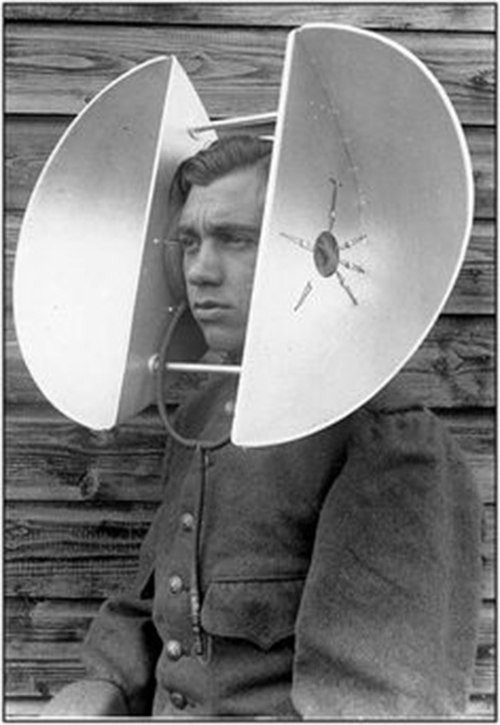

# **LING 2200**

Put some info here about the courses.

## How to use

1. fork the repo for this website and follow instructions on read me to get set up. [https://github.com/CrumpLab/LabJournalWebsite](https://github.com/CrumpLab/LabJournalWebsite)

2. Blog/journal what you are doing in R, by editing the Journal.Rmd. See the [Journal page](https://crumplab.github.io/LabJournalWebsite/Journal.html) for an example of what to do to get started learning R.

3. See the [links page](https://crumplab.github.io/LabJournalWebsite/Links.html) for lots of helpful links on learning R.

4. Change everything to make it your own.

</a>

