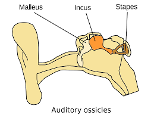

<style type="text/css">
  body{
  font-size: 12pt;
}
</style>

```{r setup, include=FALSE}
knitr::opts_chunk$set(message=FALSE,warning=FALSE, cache=TRUE)
```

----
We've spent considerable time discussing the anatomy and physiology of speech production (though we haven't yet addressed consonants, we'll get to that), so today we start our description of the process of hearing or audition. As with production, we'll need to describe some anatomy, but we'll quickly move into the functionality of the inner ear, or how sound is converted into electrical energy that is received by the brain."
----

# Anatomy of the ear

We might have some lay sense of the structures of the ear as they're talked about in every day language ("you'll blow out your ear drums!"), we've experienced or heard about common ear-related ailments (i.e., ear infections), and the outer structures are mostly visible and a salient aspect of a person's face/head.

The ear is actually made up of three different structures: the **Outer**, **Middle**, and **Inner* ear. 

## Outer ear

The outer ear is made up of two structures: the **Pinna** and the **External Auditory Meatus** (EAM). 

The pinna is the visible "ear," the cartilaginous structure that we identify as an ear, rounded and conch like, with a lobe that people pierce. 

<p align="center">
  
</p>

The EAM is the narrow tube behind the pinna, it contains cerumen (earwax) and cilia (hair), and it's where we're (NOT supposed to, but usually) jamming in q-tips. The purpose of the pinna and the EAM is to protect the structures further behind (the middle and inner ear). The wax and hairs filter out dirt and sut particles from getting further into the ear. But the EAM also serves an acoustic purpose!

The EAM can be considered a quarter-wave resonator (open at the pinna end and closed at the middle ear end), with a resonant frequency of 3.4kHz. That is well above the level of meaningful formant structure but boosts speech sounds that have high frequency noise, like fricatives. When coupled with the pinna, the entire outer ear system is broadly tuned, amplifying sounds between 2.5 and 5kHz by about 10dB.

> If the resonant frequency of the EAM is 3400Hz, what is the length of the EAM? Work on this at home and we'll discuss the solution in class.

## Middle ear

### Tympanic membrane

The transition from the outer ear to the **middle ear** is marked by the **Tympanic membrane** (TM) or commonly known as the "ear drum". The TM is a thin, oval-shaped membrane that is concave on the external (i.e., facing the EAM) surface, making it like a broad and short cone. The TM is held in position by a ligament and is itself made up of three layers and of varying thickness from the superior to inferior ends. 

<p align="center">
  
</p>

A part of the one of the bones of the middle ear, the **malleus** is embedded in the TM, you can see it in the image above like the arm of a clock. The function of the TM is to receive the fluctuations in air pressure caused by some incident sound. The TM is very sensitive to a wide range of pressures  across a wide range of frequencies. The TM is the first stop in the process of **transduction** of air pressure fluctuations (mechanical movement) to electrical impulse that is decoded by the brain.

The vibration of the TM causes the malleus to move. The malleus makes up a series of tiny bones (the smallest in your body), collectively called the **ossicles**.

### Eustachian tube

The **Eustachian tube** is a tube running from from the middle ear to the nasopharynx portion of the throat. It's made up of cartilage an is approximately 35mm long. It's normally closed at the entrance to the nasopharynx, but opens up during swallowing and yawning (can you hear a little pop when you do either of those things? that's the Eustachian tube opening and closing). The Eustachian tube keeps the middle ear vented and drained by equalizing air pressure between the middle ear and P~atm~. If the tube does not open there is negative pressure in the middle ear. When you plug your nose to allow your ear to "pop," you're forcing the Eustachian tube to open to equalize the pressure in the middle ear. The middle ear is drained of mucus via the Eustachian tube (into the pharynx, where it is then swallowed).

<p align="center">
  
</p>

### Ossicles

The ossciles are made up of three bones:

1. Malleus: connects to the TM, rather straight bone, the largest of the ossicles at around 8mm
2. Incus: also called the *anvil*, connects to the malleus at a joint, smaller than the malleus
3. Stapes: also sometimes called the  *stirrup* because it is U-shaped, with two legs connecting to a footplate

<p align="center">
  
</p>

The ossciles are held in place with ligaments, and convert the acoustic pressure fluctuations vibrating the TM into mechanical energy. 

<p align="center">
  
</p>

The footplate of the stapes is connected to the cochlea and marks the limit of the middle ear.

### Muscles of the middle ear

Two muscles of the middle ear are the **tensor tympani** and the **stapedius**. The tensor tympani is a long paired muscle of the middle ear. Its attachment to malleus, one of the three auditory ossicles, allows tightening of the tympanic membrane, reducing its vibration amplitude and thus reducing the sound transmission into the inner ear. The stapedius connects to the head of the stapes. Both muscles are involved in the *tympanic reflex*, which is a neat involuntary response of the tympani that protects the inner ear. Within 40ms of a sudden loud sound, like a gunshot or explosion, the tensor tympani and the **stapedius** muscle contract, drawing in the ossicles. This prevents the TM from violently jarring the ossicles, thereby protecting the cochlea (as we will see below). 

<p align="center">
  
</p>

The middle ear muscles also contract during vocalization as well, thereby attenuating the sound of one's own voice to the inner ear.

### Functions of the middle ear

The middle ear performs three functions:

1. It increases the amount of acoustic energy that gets transmitted to the inner ear by overcoming the impedance mismatch betwen the middle and inner ear. **Impedance**

