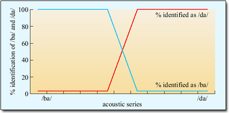
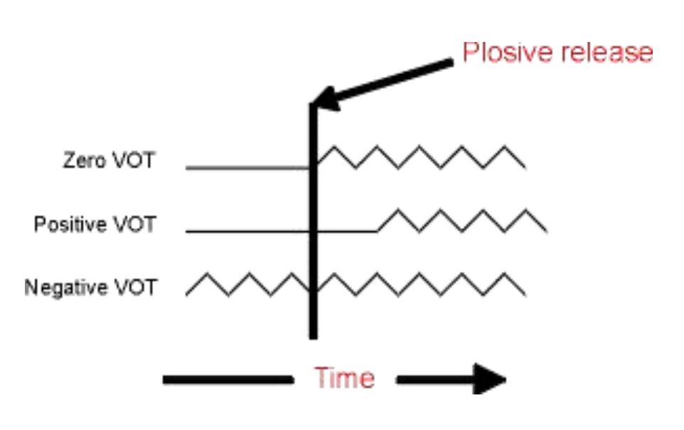

<style type="text/css">
  body{
  font-size: 12pt;
}
</style>

```{r setup, include=FALSE}
knitr::opts_chunk$set(message=FALSE,warning=FALSE, cache=TRUE)
```

----

We've spent some time discussing phonation and filtering which results in vowel (or vocalic) sounds. We've also briefly discussed the idea that perception is not a one-to-one mapping of acoustics to a representation in your brain. Today we switch gears, slightly, and introduce consonant perception. For the most part, consonants are produced with some sort of occlusion in the vocal tract, a constricting of the walls of the mouth or the contact of the tongue with the superior surface of the oral cavity. 

----

# Categorical perception

Categorical perception refers to a general phenomenon whereby humans (and other animals) categorize objects with similar features--but for our purposes it really is the study of how our built-up categories can be imposed on external features. Our notion of "chair" is such that any object with four-legs and is "sittable" might fit into that category. Crucially, my category of chair might be different from yours. We can extend this general phenomenon to the speech domain. 

In general, the vowel space is thought to be perceived more or less *continuously*. There is some intuitive sense to this, as I can seamlessly transition a production of "aah" to "ooo" and you would be hard pressed to identify when it changes category. That is, there is no clear boundary between the productions, but rather the acoustic shape shifting gives rise to a continuous perception. 

Contrast that with consonants. If a series of consonants are presented to a listener, with each consonant differing only slightly from the other in one small respect along some acoustic dimension, there would be a point in the presentation where the listener’s perception goes from one phoneme to another. On either sides of this crossover consonants are perceived as being the same.

<p align="center">
  
</p>


The image above is called a **identification function**. A stimulus (from the x-axis) is played to the listener and the listener is asked to identify the sound. The x-axis consists of a series of sound stimuli, at the left end is definitively a /ba/ and at the right end definitively a /da/. In between are 8 stimuli that are more or less /ba/ or /da/ like. If you were to hear all 10 stimuli they would slowly change from "ba" to "da". It's important to note that each stimulus in the continuum differs by exactly the same "amount." When the stimuli are played to listeners, however, they treat the left 4 stimuli as /ba/ 100% of the time(!) even though each one is actually slightly different. So the listener's brain collapses the differences and treats them all as "ba". BUT, when they get stimuli 5 and 6, they are 50% in their identification. 

The image above is an *idealized* identification curve and we don't really know what the acoustic dimension being varied along the x-axis is. A typical categorical perception task with consonants exploits a timing relationship between the release of the oral occlusion and the onset of vocal fold oscillation of the following vowel.

# Voice onset time

To begin with, the *sound* of a consonant is extremely brief. It's the release of the occlusion in the vocal tract, giving rise to a noisy burst of energy, typically called a **burst**. We can understand a lot about the consonant (whether it is a /t/ or a /d/; /p/ or /b/, etc.) from the how the burst is timed with respect to the beginning of the following vowel. This aspect of consonant acoustics, especially for consonants that are followed by a vowel, is called **voice onset time** or VOT. 

Imagine the articulatory and aerodynamic processes involved in the production of an oral consonant follow by a vowel, like "pa":

1. The articulator makes contact with the place of articulation, creating a tight seal
2. Air pressure builds up behind the constriction
3. Constriction is released
4. Voicing of the vowel begins

The synchronization of 3. and 4. characterizes VOT. 

<p align="center">
    
</p>

In the schematic image on the left, there are three different "types" of VOTs shown. 

1. Zero VOT: the release of the constriction is timed perfectly with the onset of vocal fold oscillation (similar to "voiced" consonants in North American English, "ba", "da", "ga")
2. Positive VOT: there is a brief silence or time gap between the release of the constriction and the onset of phonation (like syllable-initial "voiceless" consonants in English, "pa","ta", "ka")
3. Negative VOT: where phonation begins before the release of the consonants. We do this in connected English speech usually for voiced stop consonants, but it also happens in place of zero VOT for some speakers of English. 

Here is a continuum of [VOT](sounds/chain.wav) doing from "da" to "ta". The individual sounds from the continuum are found [here](vot_continuum.html).


