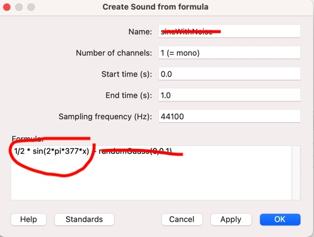

<style type="text/css">
  body{
  font-size: 12pt;
}
</style>

```{r setup, include=FALSE}
knitr::opts_chunk$set(message=FALSE,warning=FALSE, cache=TRUE)
```

Please be sure to watch and pay attention to today's Praat basics lecture as your homework assignment will rely on it. 

# Creating a pure tone in Praat

By now you should have all downloaded and explored the Praat analysis sfotware. If you haven't done so, please download it ASAP [here](https://www.praat.org). 

The purpose of today's lab is to produce and examine the characteristics of pure and complex tones discussed in lectures 1-3. Recall that we use the term "pure tone" to describe a sound that has the attributes of simple harmonic motion (in this case of an air molecule): period, frequency, wavelength, and amplitude. 

## The sine wave equation

The function that generates a sine wave (or a pure tone, simple harmonic motion, etc.) captures amplitude (A), and the frequency(f):
$$
y(x) = A \times sin(2\pi fx)
$$

Why $2\pi$? The period of the sine function is $2\pi$, which means that the value of the function is the same every $2\pi$ radians, which is a unit of angular measurement. So the curve varies over $2\pi$ radians over the course of one period(t). So because $f=\frac{1}{t}$ the sine formula above can be re-written as $sin(\frac{2\pi}{t}x)$. 

OK, so let's say we want to create a pure tone in Praat. Praat allows you to do this using a fill-in window were you specify the frequency and hit a button and there you go. *But* we're not going to do it this way. Suppose we want to make a 3 second 350Hz tone:

1. From the Praat Objects window > New > Create sound from formula\
This brings up the a window that looks like this:

<p align="center">
  
</p>
\

2. Things to look at:
    + Name--you should change this to something that describes your sound. In this case, let's change it "350Hz"
    + Start/end times--We want a 3 second tone, so start at 0, end at 3
    + For now ignore the sampling rate
    
3. The most important field is "Formula." Notice it says "1/2 * sin(2 * pi * 377 * x)" by default (the spaces don't matter). It also says "+ randomGauss(0,0.1)", which you can select and delete. What that does is add random noise to the pure tone signal. 